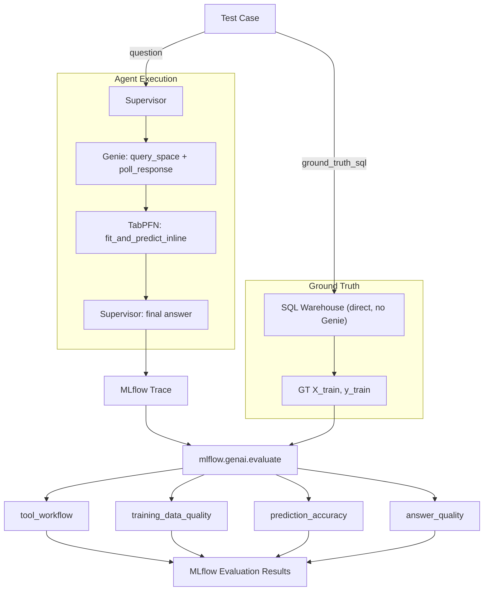
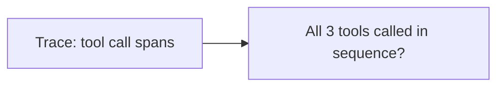
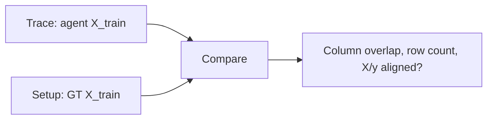
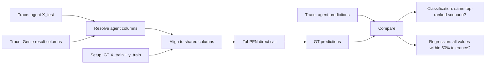
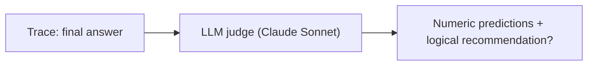

# Sales Multi-Agent Orchestrator

A multi-agent orchestrator for Enterprise Sales Analytics, built with [OpenAI Agents SDK](https://github.com/openai/openai-agents-python) and served via FastAPI on Databricks.

## Architecture

The orchestrator routes user queries to specialized subagents:

- **Genie** — queries a Databricks Genie Space for structured sales data analysis (pipeline, revenue, accounts, reps, products, etc.)
- **TabPFN** — connects to an external MCP server for tabular prediction tasks (classification and regression)

Additional subagent types (App agents, Serving Endpoints, MCP servers) can be added via `config.yaml`.

## Quick Start

1. Copy the environment template and fill in your values:
  ```bash
   cp .env.example .env
  ```
2. Edit `config.yaml` to configure your subagents (Genie space IDs, MCP connections, etc.).
3. Start the application:
  ```bash
   uv run start-app
  ```

## Scripts


| Command                     | Description                                                         |
| --------------------------- | ------------------------------------------------------------------- |
| `uv run start-app`          | Start the FastAPI application                                       |
| `uv run start-server`       | Start the agent server directly                                     |
| `uv run agent-evaluate`     | Run conversation-simulator evaluation (multi-turn, no ground truth) |
| `uv run agent-evaluate-e2e` | Run end-to-end ground-truth evaluation                              |


## End-to-End Evaluation

`uv run agent-evaluate-e2e` runs a ground-truth evaluation that validates the full predictive workflow — from SQL data retrieval through TabPFN predictions to the final natural-language answer.



### How it differs from `agent-evaluate`


|              | `agent-evaluate`                                       | `agent-evaluate-e2e`                                               |
| ------------ | ------------------------------------------------------ | ------------------------------------------------------------------ |
| Strategy     | Simulates multi-turn conversations with an LLM persona | Sends single questions with pre-computed ground truth              |
| Scorers      | Generic quality (fluency, safety, completeness, etc.)  | Domain-specific (correct tools, data quality, prediction accuracy) |
| Ground truth | None — judges evaluate style and coherence only        | SQL results + direct TabPFN predictions used as reference          |


### Prerequisites

- `DATABRICKS_WAREHOUSE_ID` set in `.env` (used to run ground-truth SQL).
- Access to the `tabpfn_databricks.agent` Delta tables (created by `00_generate_sales_data.ipynb`).
- Access to the TabPFN MCP server (configured in `config.yaml`).

### Scorers

The evaluation applies four scorers to each agent trace:

**tool_workflow**



**training_data_quality**



**prediction_accuracy**



The agent may use different features than the ground truth: Genie can return different columns, and the agent may drop constant-valued columns (e.g., `segment` when the query filters to a single segment). Before calling TabPFN, the scorer resolves which columns the agent actually kept, then subsets both GT training data and the agent's X_test to their shared columns.

**answer_quality**



| Scorer                    | What it checks                                                                                                                                                     |
| ------------------------- | ------------------------------------------------------------------------------------------------------------------------------------------------------------------ |
| **tool_workflow**         | The agent called the expected 3-tool sequence: `query_space` → `poll_response` → `fit_and_predict_inline`.                                                         |
| **training_data_quality** | Column overlap between agent and ground-truth features, row count ratio, and X/y alignment.                                                                        |
| **prediction_accuracy**   | Recomputes TabPFN predictions using ground-truth training data + the agent's X_test, then compares rankings (classification) or checks 50% tolerance (regression). |
| **answer_quality**        | LLM judge (Claude Sonnet) that verifies the final answer contains numeric predictions and a logically consistent recommendation.                                   |


### Test cases

The script ships 5 test cases covering classification and regression over the sales dataset:

1. Best promotion type for Fortune 500 high-ACV deals (classification)
2. Win probability by lead source for Mid-Market deals (classification)
3. Expected ACV for Fortune 500 SaaS across regions (regression)
4. Highest win-probability region for Fortune 500 deals (classification)
5. Days in pipeline: Outbound vs Inbound for Mid-Market (regression)

To add a new test case, append a dict to the `_TEST_CASES` list in `agent_server/evaluate_e2e.py` with the following keys:


| Key                  | Description                                          |
| -------------------- | ---------------------------------------------------- |
| `question`           | The natural-language question sent to the agent.     |
| `ground_truth_sql`   | SQL query that returns the correct training data.    |
| `target_column`      | The column to predict.                               |
| `feature_columns`    | List of feature column names.                        |
| `x_test_scenarios`   | List of dicts representing the prediction scenarios. |
| `expected_direction` | Text describing the expected shape of the answer.    |
| `task_type`          | `"classification"` or `"regression"`.                |


